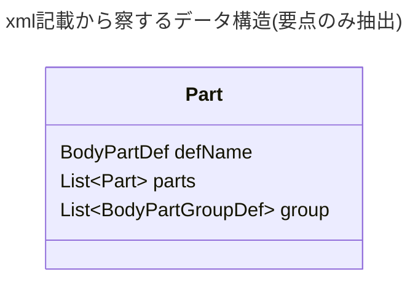

# 作成時メモ

メカノイド作成という観点でいうと必要なものは

- `ThingDef`
  - `BasePawn` を親とする必要がありそう
  - `BaseMechanoid` を親とした場合、メカクラスターやら何やらに混ざる可能性がある？
- `PawnKindDef`
  - これについては、`LightMechanoidKind` のような定義済みの親を参照させて良さそう
- `BodyDef`
  - 構成パーツ(身体部位)の組み合わせ、というか位置の定義？
  - `//ThingDef/race/body` から参照される
- `BodyPartDef`
  - 構成パーツそのものの定義
  - `//BodyDef/corePart/def` であったり `/Defs/BodyDef/corePart/parts/li/parts/li/def` から参照される
- `RecipeDef`
  - 単純に培養器のレシピなので新設が必要

## `BodyDef` について

- `corePart` を根(root node)とした、木構造として把握すれば良い
  - 木構造なので 根も枝も葉も全部 `Part`
- `Part` が指し示しているのは基本的には `BodyPartDef` と子要素となる `Part` の群
  - `group` については 子要素が2以上 (== `parts` が複数)の場合のみ必要っぽい
